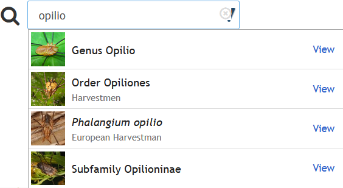

# pyinaturalist

[](https://github.com/niconoe/pyinaturalist/actions)
[](https://pyinaturalist.readthedocs.io)
[](https://pyinaturalist.readthedocs.io/en/latest/)
[](https://coveralls.io/github/niconoe/pyinaturalist?branch=main)

[](https://pypi.org/project/pyinaturalist)
[](https://anaconda.org/conda-forge/pyinaturalist)
[](https://pypi.org/project/pyinaturalist)
[](https://pypi.org/project/pyinaturalist)

[](https://mybinder.org/v2/gh/niconoe/pyinaturalist/main?filepath=examples)
[](https://open.vscode.dev/niconoe/pyinaturalist)

<br/>

[](https://pyinaturalist.readthedocs.io)

# Introduction
[**iNaturalist**](https://www.inaturalist.org) is a community science platform that helps people
get involved in the natural world by observing and identifying the living things around them.
Collectively, the community produces a rich source of global biodiversity data that can be valuable
to anyone from hobbyists to scientists.

**pyinaturalist** is an unofficial client for the [iNaturalist API](https://api.inaturalist.org/v1) that
aims to make these data easily accessible in the python programming language. 

- [Features](#features)
- [Quickstart](#quickstart)
- [Next Steps](#next-steps)
- [Feedback](#feedback)
- [Related Projects](#related-projects)

## Features
* **Easier requests:** Complete type annotations for request parameters, and simplified create/update request formats
* **Convenient responses:** Type conversions to the things you would expect in python
* **Docs:** Example requests, responses, scripts, and Jupyter notebooks to help get you started
* **Security:** Keyring integration for secure credential storage
* **Server-friendly:** Client-side rate-limiting that follows the
  [API Recommended Practices](https://www.inaturalist.org/pages/api+recommended+practices),
  so you can be nice to the iNaturalist servers and not worry about rate-limiting errors
* **Test-friendly:** A dry-run mode to preview your requests before potentially modifying data

Many of the most relevant API endpoints are included, and more are on the way:
* **Searching for:**
    * controlled terms
    * identifications
    * observations (multiple formats)
    * observation fields
    * observation species counts
    * places
    * projects
    * species
* **Text search autocompletion for:**
    * places
    * species
    * users
* **Creating and updating:**
    * observations
    * observation fields
    * observation photos
    * observation sounds

## Quickstart
Here are usage examples for some of the most commonly used features.

First, install with pip:
```bash
pip install pyinaturalist
```

Then, import the main API functions:
```python
from pyinaturalist import *
```

### Search observations
Let's start by searching for all your own observations. There are
[numerous fields you can search on](https://pyinaturalist.readthedocs.io/en/latest/modules/pyinaturalist.node_api.html#pyinaturalist.node_api.get_observations), but we'll just use `user_id` for now:
```python
>>> observations = get_observations(user_id='my_username')
```

The full response will be in JSON format, but we can just print out a few basic details:
```python
>>> for obs in observations['results']:
>>>    print(format_observations(obs))
[78242978] Species: Agelastica alni (Alder Leaf Beetle) observed by niconoe on 2021-05-10 18:45:38+01:00 at 1428 Braine-l'Alleud, Belgique
[78218860] Genus: Bradybatus observed by niconoe on 2021-05-10 15:22:49+01:00 at 1428 Braine-l'Alleud, Belgique
...
```

You can also get
[observation counts by species](https://pyinaturalist.readthedocs.io/en/stable/modules/pyinaturalist.node_api.html#pyinaturalist.node_api.get_observation_species_counts).
On iNaturalist.org, this information can be found on the 'Species' tab of search results.
For example, to get the counts of all your own research-grade observations:
```python
>>> counts = get_observation_species_counts(user_id='my_username', quality_grade='research')
>>> print(format_species_counts(counts, align=True))
[48473   ]: Species:          Ganoderma applanatum (Artist's bracket): 4
[50310   ]: Species:         Arisaema triphyllum (Jack-in-the-pulpit): 4
[50817   ]:   Genus:                     Auricularia (Wood ear fungi): 3
[81599   ]: Species:                 Silphium perfoliatum (Cup plant): 3
[120215  ]: Species:    Bombus griseocollis (Brown-belted Bumble Bee): 2
...
```

Another useful format is the
[observation histogram](https://pyinaturalist.readthedocs.io/en/stable/modules/pyinaturalist.node_api.html#pyinaturalist.node_api.get_observation_histogram),
which shows the number of observations over a given interval. The default is `month_of_year`:
```python
>>> histogram = get_observation_histogram(user_id='my_username')
>>> print(histogram)
{
    1: 8,  # January
    2: 1,  # February
    3: 19, # March
    ...,   # etc.
}
```

### Create and update observations
To create or modify observations, you will first need to log in.
This requires creating an [iNaturalist app](https://www.inaturalist.org/oauth/applications/new),
which will be used to get an access token.
```python
token = get_access_token(
    username='my_username',
    password='my_password',
    app_id='my_app_id',
    app_secret='my_app_secret',
)
```
See
[Authentication](https://pyinaturalist.readthedocs.io/en/latest/user_guide.html#authentication)
for additional authentication options, including environment variables, keyrings, and password managers.

Now we can [create a new observation](https://pyinaturalist.readthedocs.io/en/stable/modules/pyinaturalist.rest_api.html#pyinaturalist.rest_api.create_observation):
```python
from datetime import datetime

response = create_observation(
    taxon_id=54327,  # Vespa Crabro
    observed_on_string=datetime.now(),
    time_zone='Brussels',
    description='This is a free text comment for the observation',
    tag_list='wasp, Belgium',
    latitude=50.647143,
    longitude=4.360216,
    positional_accuracy=50, # GPS accuracy in meters
    access_token=token,
    photos=['~/observations/wasp1.jpg', '~/observations/wasp2.jpg']
)

# Save the new observation ID
new_observation_id = response[0]['id']
```

We can then [update the observation](https://pyinaturalist.readthedocs.io/en/stable/modules/pyinaturalist.rest_api.html#pyinaturalist.rest_api.update_observation) information, photos, or sounds:
```python
update_observation(
    17932425,
    access_token=token,
    description='updated description !',
    photos='~/observations/wasp_nest.jpg',
    sounds='~/observations/wasp_nest.mp3',
)
```

### Search species
Let's say you partially remember either a genus or family name that started with **'vespi'**-something.
The [taxa endpoint](https://pyinaturalist.readthedocs.io/en/stable/modules/pyinaturalist.node_api.html#pyinaturalist.node_api.get_taxa)
can be used to search by name, rank, and several other criteria
```python
>>> response = get_taxa(q='vespi', rank=['genus', 'family'])
```

As with observations, there is a lot of information in the response, but we'll print just a few basic details:
```python
>>> print(format_taxa(response))
[52747] Family: Vespidae (Hornets, Paper Wasps, Potter Wasps, and Allies)
[92786] Genus: Vespicula
[84737] Genus: Vespina
...
```

Oh, that's right, it was **'Vespidae'**! Now let's find all of its subfamilies using its taxon ID
from the results above:
```python
>>> response = get_taxa(parent_id=52747)
>>> print(format_taxa(response))
[343248] Subfamily: Polistinae (Paper Wasps)
[ 84738] Subfamily: Vespinae (Hornets and Yellowjackets)
[119344] Subfamily: Eumeninae (Potter and Mason Wasps)
...
```

Just one last example. There is a [taxon autocomplete](https://pyinaturalist.readthedocs.io/en/stable/modules/pyinaturalist.node_api.html#pyinaturalist.node_api.get_taxa_autocomplete)
text search endpoint, which is a bit more niche, and is intended for autocomplete interfaces like
the one on iNaturalist.org:


But it also provides an easy way to search the iNaturalist taxonomy database by taxon name.
Here is a quick example that will run searches from console input:

```python
while True:
    query = input("> ")
    response = get_taxa_autocomplete(q=query)
    print(format_taxa(response, align=True))
```

Example usage:

```python
> opilio
[  527573]        Genus                                              Opilio
[   47367]        Order                              Opiliones (Harvestmen)
[   84644]      Species             Phalangium opilio (European Harvestman)
...
> coleo
[  372759]     Subclass     Coleoidea (Octopuses, Squids, and Cuttlefishes)
[   47208]        Order                                Coleoptera (Beetles)
[  359229]      Species  Coleotechnites florae (Coleotechnites Flower Moth)
...
<Ctrl-C>
```

## Next Steps
For more information, see:

* [User Guide](https://pyinaturalist.readthedocs.io/en/latest/user_guide.html):
  introduction and general features that apply to most endpoints
* [Endpoint Summary](https://pyinaturalist.readthedocs.io/en/latest/endpoints.html):
  a complete list of endpoints wrapped by pyinaturalist
* [Examples](https://pyinaturalist.readthedocs.io/en/stable/examples.html):
  data visualizations and other examples of things to do with iNaturalist data
* [Reference](https://pyinaturalist.readthedocs.io/en/latest/reference.html): Detailed API documentation
* [Contributing Guide](https://pyinaturalist.readthedocs.io/en/stable/contributing.html):
  development details for anyone interested in contributing to pyinaturalist
* [History](https://github.com/niconoe/pyinaturalist/blob/dev/HISTORY.md):
  details on past and current releases
* [Issues](https://github.com/niconoe/pyinaturalist/issues): planned & proposed features

## Feedback
If you have any problems, suggestions, or questions about pyinaturalist, please let us know!
Just [create an issue](https://github.com/niconoe/pyinaturalist/issues/new/choose).
Also, **PRs are welcome!**

**Note:** pyinaturalist is developed by members of the iNaturalist community, and is not endorsed by
iNaturalist.org or the California Academy of Sciences. If you have non-python-specific questions
about iNaturalist, the [iNaturalist Community Forum](https://forum.inaturalist.org/) is the best
place to start.

## Related Projects
Other python projects related to iNaturalist:

* [Dronefly](https://github.com/synrg/dronefly): A Discord bot with iNaturalist data access features,
  used by the iNaturalist Discord server.
* [pyinaturalist-convert](https://github.com/JWCook/pyinaturalist-convert): Tools to convert observation data to and from multiple formats
* [pyinaturalist-open-data](https://github.com/JWCook/pyinaturalist-open-data):  Tools for working with [iNaturalist open data](https://registry.opendata.aws/inaturalist-open-data/)
* [pyinaturalist-notebook](https://github.com/JWCook/pyinaturalist-notebook): Jupyter notebook Docker image for pyinaturalist
