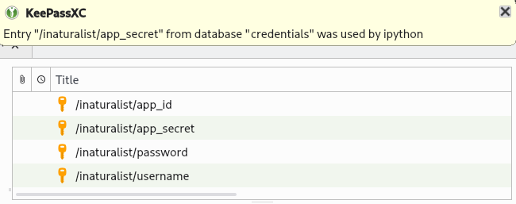

General Usage
=============
Following is some general usage information that applies to most or all pyinaturalist functions.

.. _auth:

Authentication
--------------
For any endpoints that create, update, or delete data, you will need to authenticate using credentials for an
`iNaturalist Application <https://www.inaturalist.org/oauth/applications/new>`_.

See `iNaturalist documentation <https://www.inaturalist.org/pages/api+reference#auth>`_
for more details on authentication, and see :py:func:`.get_access_token` for pyinaturalist usage info and examples.

.. note::

    Read-only requests generally don't require authentication; however, if you want to access
    private data visible only to your user (for example, obscured or private coordinates),
    you will need to use an access token.

In addition to :py:func:`.get_access_token` arguments, there are some other options for
providing credentials:

Environment Variables
^^^^^^^^^^^^^^^^^^^^^^^^^^^^^^

You may provide credentials via environment variables instead of arguments. The
environment variable names are the keyword arguments in uppercase, prefixed with ``INAT_``:

* ``INAT_USERNAME``
* ``INAT_PASSWORD``
* ``INAT_APP_ID``
* ``INAT_APP_SECRET``

**Examples:**

.. admonition:: Set environment variables in python:
    :class: toggle

    >>> import os
    >>> os.environ['INAT_USERNAME'] = 'my_username'
    >>> os.environ['INAT_PASSWORD'] = 'my_password'
    >>> os.environ['INAT_APP_ID'] = '33f27dc63bdf27f4ca6cd95dd9dcd5df'
    >>> os.environ['INAT_APP_SECRET'] = 'bbce628be722bfe2abd5fc566ba83de4'

.. admonition:: Set environment variables in a POSIX shell (bash, etc.):
    :class: toggle

    .. code-block:: bash

        export INAT_USERNAME="my_username"
        export INAT_PASSWORD="my_password"
        export INAT_APP_ID="33f27dc63bdf27f4ca6cd95dd9dcd5df"
        export INAT_APP_SECRET="bbce628be722bfe2abd5fc566ba83de4"

.. admonition:: Set environment variables in a Windows shell:
    :class: toggle

    .. code-block:: bat

        set INAT_USERNAME="my_username"
        set INAT_PASSWORD="my_password"
        set INAT_APP_ID="33f27dc63bdf27f4ca6cd95dd9dcd5df"
        set INAT_APP_SECRET="bbce628be722bfe2abd5fc566ba83de4"

.. admonition:: Set environment variables in PowerShell:
    :class: toggle

    .. code-block:: powershell

        $Env:INAT_USERNAME="my_username"
        $Env:INAT_PASSWORD="my_password"
        $Env:INAT_APP_ID="33f27dc63bdf27f4ca6cd95dd9dcd5df"
        $Env:INAT_APP_SECRET="bbce628be722bfe2abd5fc566ba83de4"

Note that in any shell, these environment variables will only be set for your current shell
session. I.e., you can't set them in one terminal and then access them in another.

Keyring Integration
^^^^^^^^^^^^^^^^^^^^^^^^^^^^^^

To handle your credentials more securely, you can store them in your system keyring.
You could manually store and retrieve them with a utility like
`secret-tool <https://manpages.ubuntu.com/manpages/xenial/man1/secret-tool.1.html>`_
and place them in environment variables as described above, but there is a much simpler option.

Direct keyring integration is provided via `python keyring <https://github.com/jaraco/keyring>`_. Most common keyring bakcends are supported, including:

* macOS `Keychain
  <https://en.wikipedia.org/wiki/Keychain_%28software%29>`_
* Freedesktop `Secret Service
  <http://standards.freedesktop.org/secret-service/>`_
* KDE `KWallet <https://en.wikipedia.org/wiki/KWallet>`_
* `Windows Credential Locker
  <https://docs.microsoft.com/en-us/windows/uwp/security/credential-locker>`_

To store your credentials in the keyring, run :py:func:`.set_keyring_credentials`:

    >>> from pyinaturalist.auth import set_keyring_credentials
    >>> set_keyring_credentials(
    >>>     username='my_username',
    >>>     password='my_password',
    >>>     app_id='33f27dc63bdf27f4ca6cd95dd9dcd5df',
    >>>     app_secret='bbce628be722bfe2abd5fc566ba83de4',
    >>> )

Afterward, you can call :py:func:`.get_access_token` without any arguments, and your credentials
will be retrieved from the keyring. You do not need to run :py:func:`.set_keyring_credentials`
again unless you change your iNaturalist password.

Password Manager Integration
^^^^^^^^^^^^^^^^^^^^^^^^^^^^^^

Keyring integration can be taken a step further by managing your keyring with a password
manager. This has the advantage of keeping your credentials in one place that can be synced
across multiple machines. `KeePassXC <https://keepassxc.org/>`_ offers this feature for
macOS and Linux systems. See this guide for setup info:
`KeepassXC and secret service, a small walk-through
<https://avaldes.co/2020/01/28/secret-service-keepassxc.html>`_.

   Credentials storage with keyring + KeePassXC

Dry-run mode
------------
While developing & testing an application that uses an API or other remote service, it can be
useful to temporarily mock out HTTP requests, especially requests that add, modify, or delete
real data. Pyinaturalist has some settings to make this easier.

Dry-run all requests
^^^^^^^^^^^^^^^^^^^^^^^^^^^^^^
To enable dry-run mode, set the ``DRY_RUN_ENABLED`` variable. When set, requests will not be sent
but will be logged instead:

.. code-block:: python

    >>> import logging
    >>> import pyinaturalist

    # Enable at least INFO-level logging
    >>> logging.basicConfig(level='INFO')

    >>> pyinaturalist.DRY_RUN_ENABLED = True
    >>> get_taxa(q='warbler', locale=1)
    {'results': [], 'total_results': 0}
    INFO:pyinaturalist.api_requests:Request: GET, https://api.inaturalist.org/v1/taxa,
        params={'q': 'warbler', 'locale': 1},
        headers={'Accept': 'application/json', 'User-Agent': 'Pyinaturalist/0.9.1'}

Or, if you are running your application in a command-line environment, you can set this as an
environment variable instead (case-insensitive):

.. code-block:: bash

    $ export DRY_RUN_ENABLED=true
    $ python my_script.py

Dry-run only write requests
^^^^^^^^^^^^^^^^^^^^^^^^^^^^^^
If you would like to run ``GET`` requests but mock out any requests that modify data
(``POST``, ``PUT``, ``DELETE``, etc.), you can use the ``DRY_RUN_WRITE_ONLY`` variable
instead:

.. code-block:: python

    >>> pyinaturalist.DRY_RUN_WRITE_ONLY = True

    # Also works as an environment variable
    >>> import os
    >>> os.environ["DRY_RUN_WRITE_ONLY"] = 'True'

User Agent
----------
While not mandatory, it is considered good practice in the iNaturalist community to set a custom `user-agent <https://en.wikipedia.org/wiki/User_agent>`_ header to your API
calls. That allows iNaturalist to identify "who's doing what" with their APIs, and maybe contact you back in case they want to start
a discussion about how you use them.

It is recommended to set this user-agent field to either something that identifies the project (``MyCoolAndroidApp/2.0``) or its
contact person (``Jane Doe, iNat user XXXXXX, jane@doe.net``).

Pyinaturalist therefore provides a couple of features to make that easy:

.. code-block:: python

    import pyinaturalist
    from pyinaturalist.node_api import get_observation

    pyinaturalist.user_agent = "MyCoolAndroidApp/2.0 (using Pyinaturalist)"

    # From now on, all API calls will use this user-agent.

    t = get_access_token('username', 'password', 'app_id', 'app_secret')
    do_something_else()
    get_observation(observation_id=1234)
    ...

In the rare cases where you want to use multiple user agents in your script, you can configure it per call:

.. code-block:: python

    get_observation(observation_id=16227955, user_agent='AnotherUserAgent')

All functions that communicate with the API accept the `user_agent` optional parameter. If you don't configure the user agent, `Pyinaturalist/<VERSION>` will be used.

