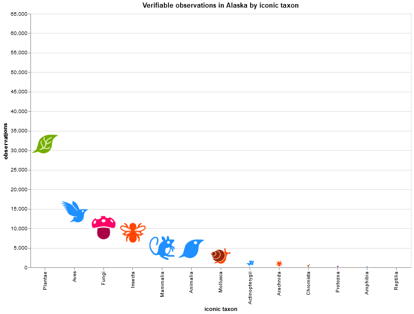

# Pyinaturalist usage examples

This folder contains some examples of building data visualizations and other neat things using
iNaturalist data. See [documentation](https://pyinaturalist.readthedocs.io/en/stable/examples.html)
for more details.

## Example visualizations

